# XPS

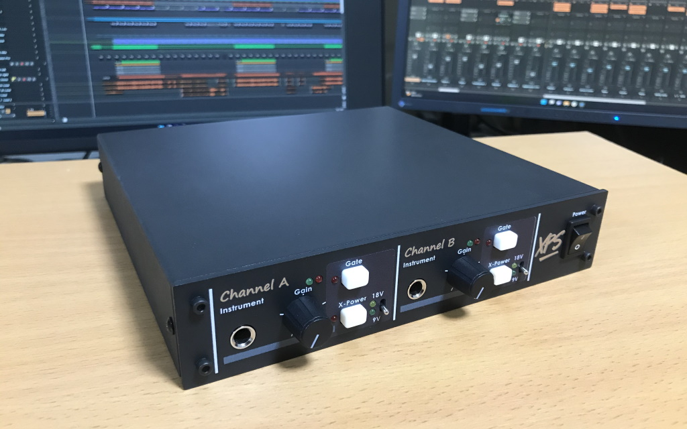  

ハードウェアプロジェクト**XPS**のデザインについてまとめます。

## 1. 概要

**XPS**はDTM用途を想定した、電気ギターなどの電気楽器をオーディオ機器の平衡ライン入力に接続するためのフロントエンドです。ハイインピーダンスのバッファアンプと、アクティブサーキットのための給電回路 [(Appendix 1)](#appendix-1-電気楽器の外側から給電する仕組み) を備えます。

* 独立2チャネル
* 1Uハーフラックサイズ
* AC電源: 100～115V|200～230V切替

**バッファアンプ**[^1]
* 入力インピータンス: 1MΩ typ.
* ゲイン可変範囲: 0～20dB typ.
* 入力スイング幅: ±7.0V typ.
* 出力スイング幅: ±9.9V typ.
* バンド幅: 1～1MHz typ. @Gain=0dB
* クリックレスミュート機能
* トランスレス平衡ライン出力、片極を接地してシングルエンド動作可能、600Ω 1μFの負荷を安定してドライブ可能 (要確認)

[^1]: 入出力のスイング幅やバンド幅は採用したオペアンプの種類に依存する

**給電回路**
* 出力電圧: 9V|18V切替
* 電流制限: 100mA/チャネル typ.
* 短絡・過熱・逆電圧・逆電流に対する保護

## 2. ツールとマテリアル

**ソフトウェアツール**
* 回路作図: [BSch3V](https://www.suigyodo.com/online/schsoft.htm) 0.83.05
* PCB設計: [KiCad](https://www.kicad.org/) 6.0
* ファームウェア開発: [MPLAB X IDE](https://www.microchip.com/en-us/tools-resources/develop/mplab-x-ide) v6.00, [Atmel AVR GNU Toolchain](https://www.microchip.com/en-us/tools-resources/develop/microchip-studio/gcc-compilers) v3.62
* 筐体作図: [QCAD](https://qcad.org/) 3.27
* 筐体印刷データ作画: [Inkscape](https://inkscape.org/) 1.1
* 筐体印刷データCMYK出力: [Scribus](https://www.scribus.net/) 1.5.7
* 部品の3Dモデリング: [OpenSCAD](https://openscad.org/) 2021.01

**ハードウェアツール**
* AVRプログラマ: [MPLAB SNAP](https://www.microchip.com/en-us/development-tool/PG164100) or [MPLAB PICkit™ 4](https://www.microchip.com/en-us/development-tool/PG164140)、MPLAB X IDEと互換性のあるISPライタなら何でも
* DC電圧計: 電源回路の出力電圧を調節するために必要ですが、とりあえず3 1/2桁のDMMで十分です。
* オシロスコープ: 発振やオーバーシュートを観察するためにはアナログ帯域が少なくとも10MHz程度必要です。

**CMYK ICCプロファイル**
* [JapanColor2011 ICCプロファイル](https://japancolor.jp/icc.html)

**ブラシフォント**
* [Free Hey November Brush Font](https://www.behance.net/gallery/86877867/Free-Hey-November-Brush-Font)

**その他**
* ハンダとハンダゴテ、ニッパーとラジオペンチ、ヤスリ、3Dプリンタ、等々
* ビニル絶縁電線、スペーサー、ネジ、ワッシャー、アルミ板、等々

## 3. 回路の略解

[回路図](media/schematics.pdf)

### 3-1. 主電源 (XPS:PS-AC, XPS:PS-DC)

* トロイダルトランスを採用
* 古典的なドロッパ方式による11V・22Vの2レール、300mA出力
* レギュレータICにLT1963AとLT3015を採用
* 軽負荷時にレギュレータICの耐圧不足を補う電圧リミッタ

AC入力電圧範囲をなるべく広く取るため、出力電圧が低めのトランスとLDOを組み合わせ、リプル下限をなるべく持ち上げておくために平滑キャパシタは大きめに取っています。

レギュレータ回路の放熱について。ACライン電圧の許容範囲とトランスの変動率から、レギュレータ回路の入力電圧は幅広く変化します。負荷が重くなるほどトランスにおける電圧降下が大きくなるので、レギュレータ回路自体の損失が最大化するのは必ずしも負荷が最大の時ではありません。正確な値を求めるためには負荷変動とトランスの変動率をモデル化したシミュレーションが必要です [(Appendix 2)](#appendix-2-レギュレータの損失のシミュレーション)。
とはいえ、レギュレータ回路における損失の最悪値として {最大電圧降下×最大負荷電流} を考えてもそれほど大きな値ではないので、シャーシにしっかり熱結合させておけばヒートシンクとして十分です。元よりラックマウントする運用形態においてはシャーシ内の空気の循環は期待できないので、排熱は直接シャーシに逃がす以上に確実な方法はありません。

### 3-2. バッファアンプ (XPS:Channel)

* 単電源動作
* JFET入力オペアンプOPA1641[^2] を採用した非反転可変ゲインのヘッドアンプ
* オペアンプOPA1602[^3]を採用したトランスレス平衡ラインドライバ[^4]
* フォトリレーを使用したトランスミッションゲート

[^2]: JFET入力タイプのシングルオペアンプのLF356、OPA604などで代替可能 (要確認)
[^3]: ドライブ能力の高いデュアルオペアンプのNE5532、NJM4580などで代替可能 (要確認)
[^4]: モノリシックICで類似のものにはPMI (現ADI) SSM2142、TI DRV134、THAT 1646などがある

単電源動作ではグラウンドにリターン電流が流れるため音質の面では不利ですが、Hi-Fiオーディオが目的ではないので良しとします。

ラインドライバの位相補償キャパシタは10pFとしていますが、最適値は採用するオペアンプの種類によって異なります。小さ過ぎると発振し易くなります。基板単体で安定していても、ケーブルを接続すると数MHzの高周波で発振することがあります。大き過ぎると高域特性を鈍らせますが、不要な帯域を欲張るよりは安全側に倒しておくのも一法です。100pFでは100kHz程度でロールオフします。

給電回路のON/OFF操作により電気楽器側でポップ雑音の発生が予想できるので、適宜ミュート出来るようにトランスミッションゲートを設けます。フォトリレーを使用し、定電流ドライブに時定数を掛けることで遷移の際のクリック雑音を防ぎます。フォトリレーはゲート電位がフローティングしているため、信号の振幅に依存したON抵抗の変動は無く、歪みは発生しません。

### 3-3. 給電回路 (XPS:Channel:XPower)

* 2系統の電源レールを切り替えるマルチプレクサ
* レギュレータICにLT3066を採用
* ロジックインターフェース

制御可能なシャットダウン、設定可能な電流制限、パワーグッドフラグを備えます。既成のレギュレータICを採用するのはディスクリートと較べて簡単なのはもちろん、電流制限、熱制限、逆電流保護、逆出力保護など各種保護回路の充実も利点です。

### 3-4. コントローラ (XPS:Channel:Controller) とファームウェア

AVRマイコンのATtiny44Aでピークインジケータとスイッチ入力を制御します。クロックの飛び移りを低減するためなるべく低周波・低電圧で動作させるのが望ましいですが、当デザインでは8MHz 3.3V駆動としています[^5]。
* 信号レベル監視のためADCをフリーランモード、およそ19kHzのサンプリングレートで動作させます。ADC割り込みハンドラにおいて波形処理します。
* チャタリング除去のため、メインループにおいてスイッチ入力をおよそ5msの間隔でポーリングします。ポーリング間隔はADC割り込みをカウントして作り出します。
* 電気楽器側で発生するポップ雑音を自動的に遮断するため、給電回路のON/OFFや電圧切り替え時にトランスミッションゲートを連動します。
* 給電回路のパワーグッドフラグと主電源の電圧を監視し、保安動作をします。

[^5]: ブレッドボードでの簡易的な実験では、3.3V駆動の場合には5V駆動と比較してクロック由来の16MHzのスペクトルが6dB程度低下した

## 4. 筐体と組み立て

筐体はアルミの箱にアルミパネルを組み合わせた二重パネル構造で、ジャックやポテンショメータの固定ナットを隠蔽してすっきりさせます (図4-1)。見栄えは向上しますが[^6]、コストも上がります。製作例ではタカチ社のカスタム加工サービスを利用し、シャーシにはMBFシリーズ、アルミパネルにはNPシリーズを組み合わせました。インクジェット印刷が利用できますが、CMYK色データの用意が必要です[(Appendix 3)](#appendix-3-フリーソフトでcmykデータを出力する手順)。  
スペーサやスイッチキャップ、治具などの作成には3Dプリンタを活用します。  
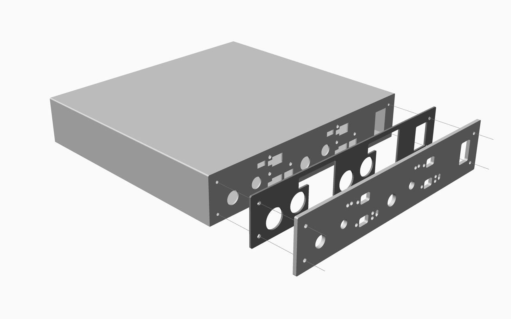  
**図4-1. 二重パネル構造**  

[^6]: 個人の主観による

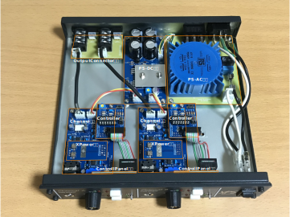

**図4-2. 基板の組み込み**  

主電源レギュレータ基板 (XPS:PS-DC) はアルミブロックを介してシャーシと熱結合します(図4-3, 4-4)。  
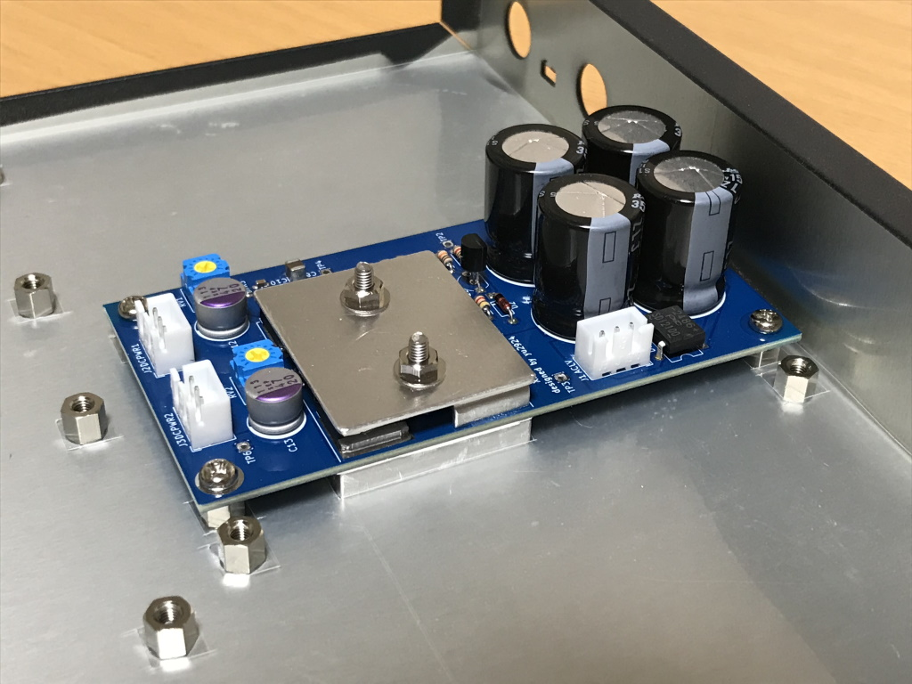   
**図4-3, 4-4. 主電源のヒートシンク構造**  

バッファアンプ基板 (XPS:Channel) と 出力ジャック基板 (XPS:OutputConnector) では、ジャックやポテンショメータをハンダで固定する際にプリントしたスペーサを合わせて、穴位置のずれを防ぎます (図4-5)。  
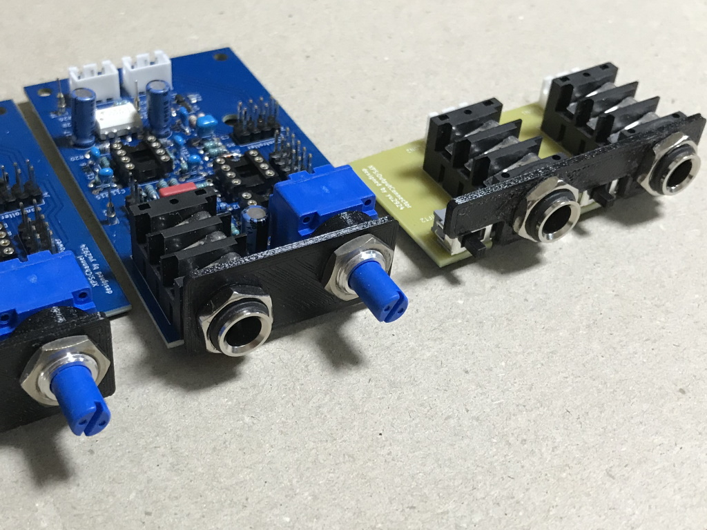  
**図4-5. スペーサを固定治具として使用**  

ジャックやポテンショメータはシャーシマウントとし、ケーブルの挿抜やツマミ操作がハンダ部分に機械的なストレスを与えにくい構造です (図4-6)。  
  
**図4-6. ジャックやポテンショメータを直接シャーシに固定**  

給電回路基板 (XPS:Channel:XPower) とコントローラ基板 (XPS:Channel:Controller) は、バッファアンプ基板 (XPS:Channel)の子基板としてピンヘッダ・ソケットを介して接続します。(図4-7)  
  
**図4-7. 子基板の装着**  

操作パネル基板 (XPS:Channel:ControlPanel) の組み立てには、治具をプリントしてLEDとスイッチの位置決めに使います。(図4-8, 4-9)  
コントローラ基板 (XPS:Channel:Controller) とはフラットケーブルで接続します。  
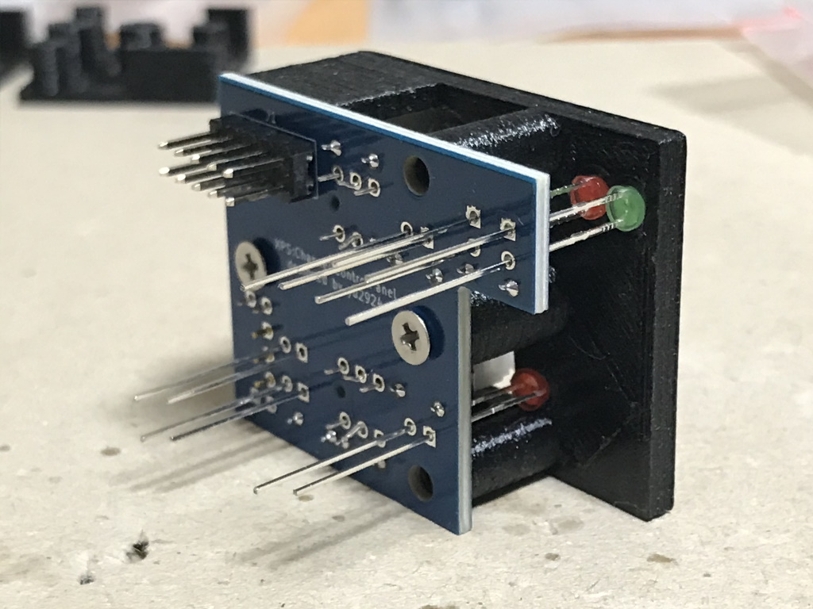 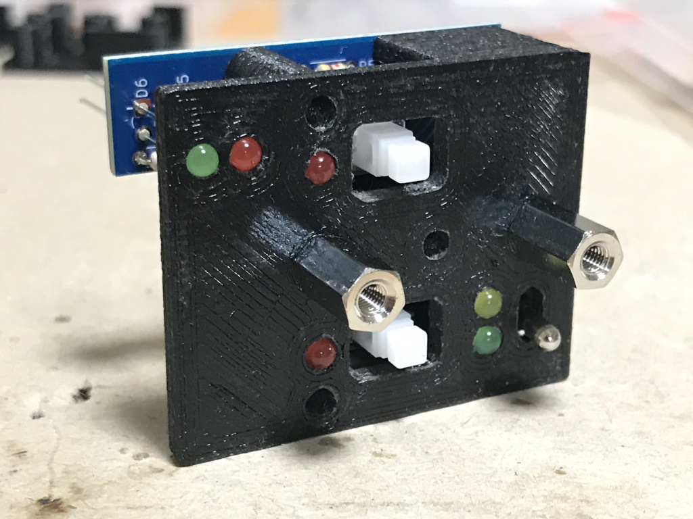  
**図4-8, 4-9. 治具を使用した位置決め**  

フロントパネルはM3ボルトでシャーシに固定します。ハーフラックトレイに乗せるため、シャーシの底面を2mmほど浮かすようになっています (図4-10)。  
  
**図4-10. フロントパネル構造**  

**組み立て後の調節手順**
1. 主電源レギュレータ基板 (XPS:PS-DC) の出力電圧を調節する。あらかじめRV1とRV2を左手最小位置に回し切っておき、主電源をONにする。最初にRV1で11Vレールを調節し、次にRV2で22Vレールを調節する。11Vレールは9V給電のために最低でも11Vあった方が良いが、22Vレールは実際には21V程度あれば十分である。
2. ファームウェアを書き込む。主電源を入れた状態でコントローラ基板 (XPS:Channel:Controller) のISPヘッダにAVRライタを接続し、書き込む。
3. 給電回路基板 (XPS:Channel:XPower) の出力電圧を調節する。あらかじめRV1とRV2を左手最小位置に回し切っておき、給電回路をONにする。最初にRV1で9Vを調節し、次にRV2で18Vを調節する。厳密である必要は無く、長いケーブルを介して給電することを考えると少し高めに設定しておいても良いのではないかと思う。  
:warning:18V側の上がり過ぎに注意する。給電回路に採用した**LT3066の最大定格出力は20Vである**ため、過渡的なオーバーシュートを含め20Vを超えてはいけない。
4. ピークインジケータの感度を調節する。バッファアンプ基板 (XPS:Channel) にオーディオ信号を入力し、テストポイントTP3において±7Vpeakにスイングしたときにインジケータの赤ランプが点灯するようにコントローラ基板 (XPS:Channel:Controller) のRV1を調節する。

---

## Appendix 1. 電気楽器の外側から給電する仕組み

アクティブサーキットを内蔵した電気ギターなどの電気楽器によく見られる仕組みとして、出力のTRSジャックにTSプラグを差し込むことでsleeve端子とring端子を短絡させ、バッテリー接続をONするものがあります (図A1-1)。  
  
**図A1-1. TRSジャックを使ったバッテリースイッチ**  

このような仕組みにおいては、バッテリーの代わりに短絡クリップ (図A1-2) を繋いでおけば、TRSケーブルのring端子を経由してアクティブサーキットに給電することができます (図A1-3)。楽器の改造は必要ありません。当デザインではこの方法を採用しています。  
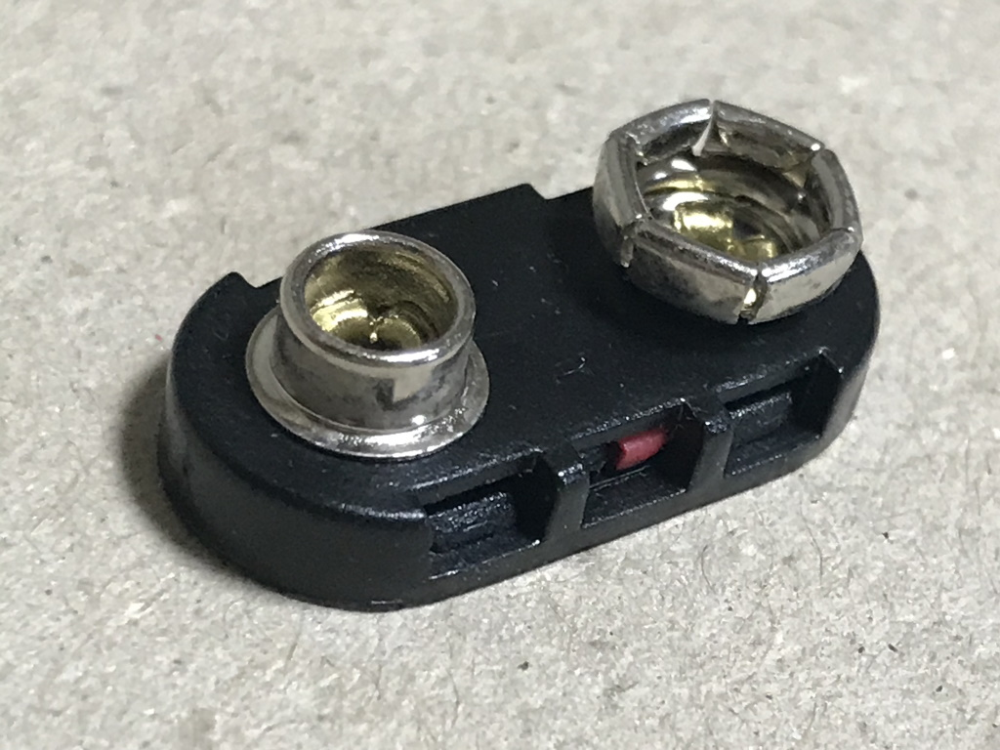  
**図A1-2. バッテリースナップを加工して作成した短絡クリップの例**  
  
**図A1-3. TRSケーブルを使った外部からの給電**  

>市販の製品の中にも、同様な方法でアクティブサーキットに給電できるものがありました。(要確認)
>* [EMG Power Supplies](https://www.emgpickups.com/parts/power-supplies.html)
>* Line6 Variax XPS-AB, XPS-Mini, XPS-DI
>* Steinberger A-100 Phantom Power Supply

一方、絶縁された連動スイッチでバッテリー接続をONするタイプの電気楽器も存在します (図A1-4)。このような仕組みでは、ジャックを介して外部から給電することは出来ません。  
  
**図A1-4. 絶縁された連動スイッチによるバッテリースイッチ**  

## Appendix 2. レギュレータの損失のシミュレーション

レギュレータの放熱方法について検討するため、パワー半導体における損失をシミュレーションしてみます。ここではLTspiceを利用してみました。
トランスの変動率仕様あるいは実測値からおよその巻線抵抗を割り出して設定します。回路は実際のものと全く同じである必要はありません。入出力電位差と負荷電流を揃えれば損失の値はおのずと等しくなります。ここで負荷を0～300mAまでスイープさせてみます。(図A2-1)  
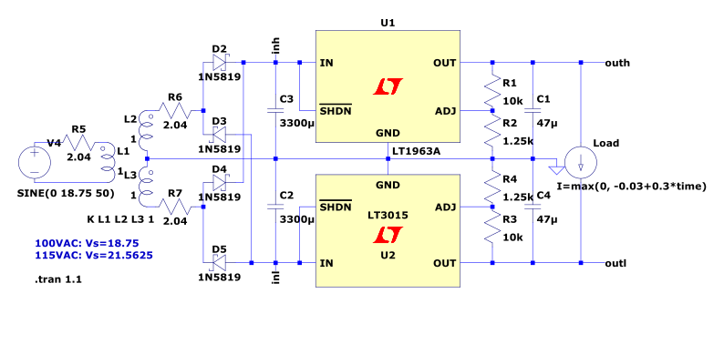  
**図A2-1. 損失シミュレーション回路**  

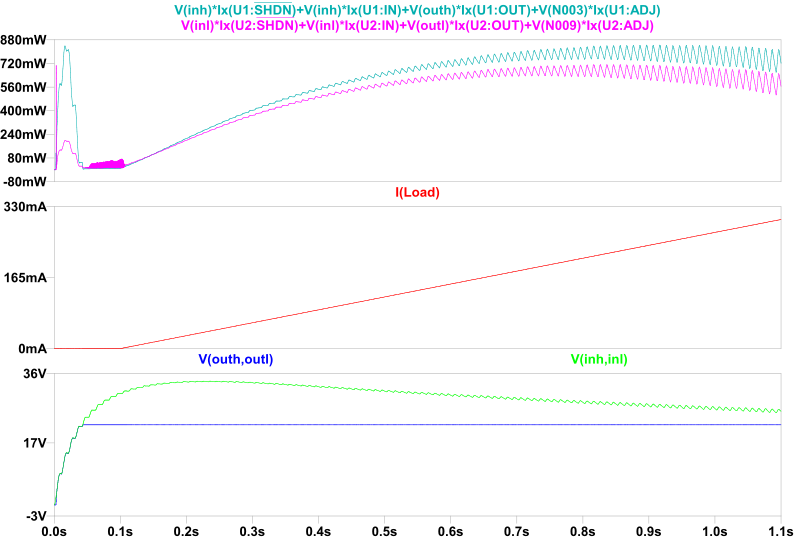

**図A2-2. 損失シミュレーション (100V AC)**  

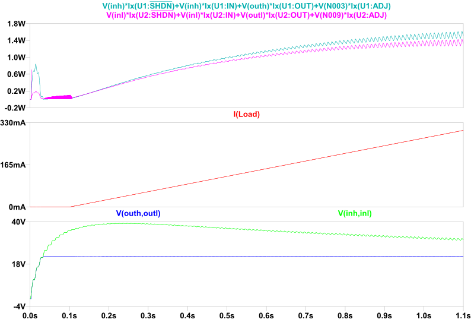

**図A2-3. 損失シミュレーション (115V AC)**  

2つのレギュレータICにおける最大損失はおよそ以下の表のように読み取れます。

|                |LT1963A|LT3015|
|----------------|------:|-----:|
|100V AC (図A2-2)|  750mW| 630mW|
|115V AC (図A2-3)|   1.5W|  1.3W|

これらの値を元に、許容可能な温度上昇と放熱経路の熱抵抗を勘案して放熱の仕組みを決定します。

## Appendix 3. フリーソフトでCMYKデータを出力する手順

タカチ社のカスタム加工サービスを利用する際に、インクジェット印刷を依頼するためにはCMYK色のデータが必要になります。Adobe Illustratorを利用できればAI形式で出力して事足りるのですが、さもなければ以下の手順を踏んでPDF形式のデータを作成できます。

1. Inkscapeを利用してSVGを作成する。Inkscapeは直接CMYKデータを出力できないが、ドキュメントプロパティにCMYKプロファイルを設定して、カラープロファイルの範囲に収まる色だけを使用して描画することができる。
2. Scribusを利用してSVGからCMYKのPDFを出力する。  
まずSVGを読み込み、**File|Document Setup|Color Management**からCMYKプロファイルが割り当てられていることを確認する。
3. 次に**Edit|Colours and Fills**から、全ての使用色が**Colour Model: CMYK**であることを確認する。
4. 最後に**File|Export|Save as PDF**から、**Colour**タブで**Output Intended For: Printer**であることを確認して出力する。
